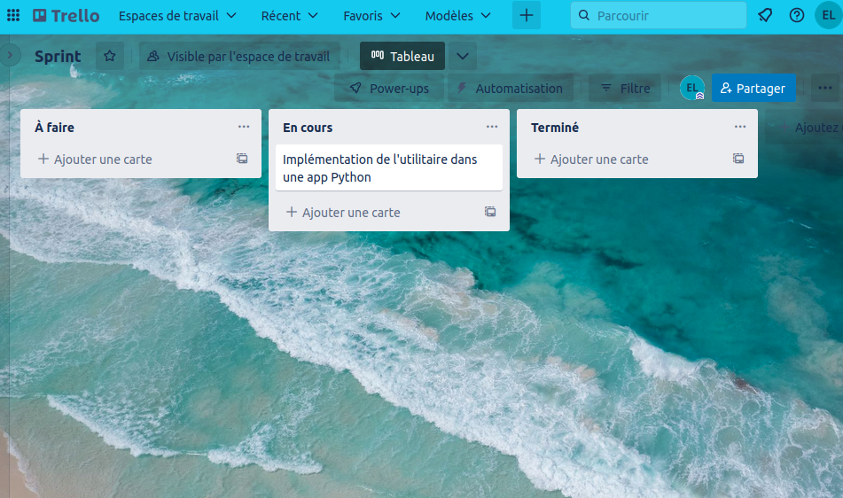
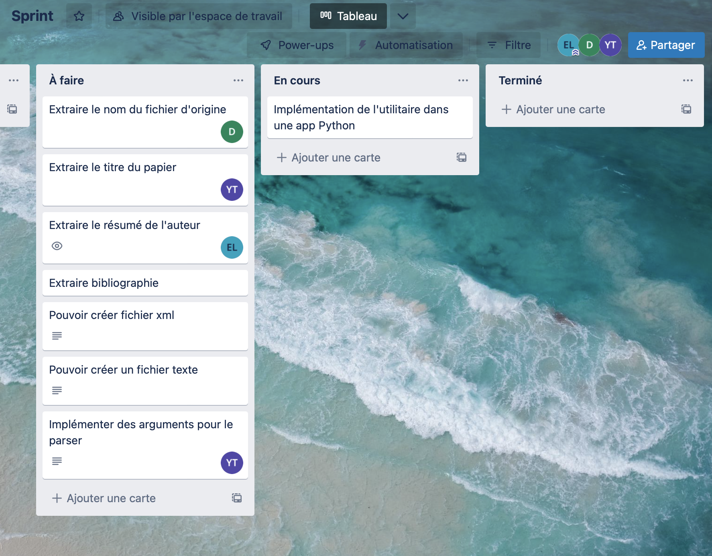

# Sprint 3 - Parseur d’articles scientifiques en format texte

Repo Github : https://github.com/elliottlepine/scrum-tp/tree/GL-1-Veille-techno-pdf2text

Elliott Lépine, Lyes Douki, Yacine Trousselle

## Compte rendu

### Analyse du besoin (17/11/2022 - 9h)

Voir [comprehension.md](comprehension.md)

### Planification Sprint 1 (17/11/2022)

Réunion de planification avec les 3 membres de l'équipe.

Remplissage du backlog avec des tickets atomiques respectant le cahier des charges.

Paramétrage du premier sprint.

Tickets GL-1 et GL-2 à faire.

Voir [backlog.md](backlog.md)

### Rétrospective du sprint 1 et planification du sprint 2 (05/12/2022)

Les tickets du sprint 1 n'étaient pas tout à fait terminés en raison des contraintes de temps.

Ils passent sur le sprint 2, et on ajoute les tickets GL-4 et le GL-5.
Le ticket GL-8 est quant à lui annulé.

L'équipe a décidé d'un commun accord de développer le logiciel en Python et d'utiliser l'utilitaire pdftotext, suite à la veille technologique réalisée lors du sprint 1.

### Simili daily-scrum de mi-séance (05/12/2022)

L'équipe s'est réunie au bout d'1h30 pour faire le point sur l'avancement des tâches respectives.

Le choix de l'utilitaire s'est finalement porté sur pdftotext, puisque les essais réalisés avec pdf2text n'étaient pas lisibles lorsque le document contenait 2 colonnes.

Il a été décidé de passer toute l'équipe sur une première implémentation de pdftotext dans l'app Python.

Un Trello a été créé pour pouvoir gérer le backlog de manière plus simple

### Rétrospective du sprint 2 et planification du sprint 3

Les tâches d'extraction n'ont pas pu être effectuées lors du sprint 2.

Elles ont été trasférées sur le sprint 3, en plus de la tâche de conversion en XML.

Ces changements ont été reportés sur le Trello du projet.

